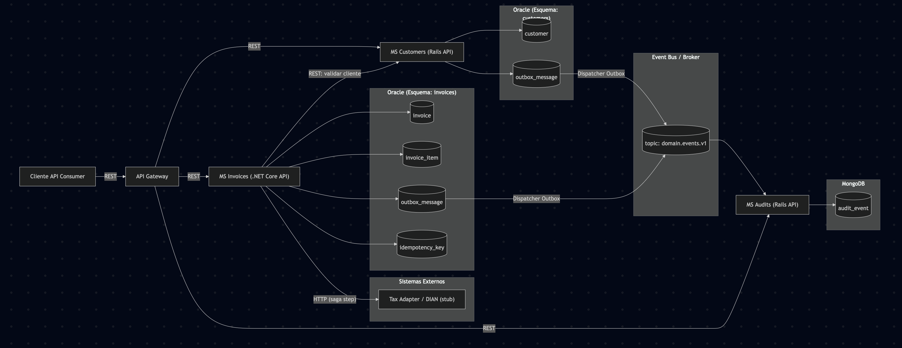

# Arquitectura del Sistema - Double-V Partners

## 1. Microservicios Principales

### [customers-service (Ruby on Rails)](https://github.com/JuanSantamariaCol/double-v-customers)
Servicio encargado de la gestión de clientes del sistema.

### [invoices-service (.NET Core)](https://github.com/JuanSantamariaCol/double-v-invoices)
Servicio responsable de la gestión de facturas y facturación electrónica.

### [audits-service (Ruby on Rails)](https://github.com/JuanSantamariaCol/double-v-audits)
Servicio dedicado a la auditoría y trazabilidad de eventos del sistema.

---
## 2. Responsabilidades e Interacciones

### @customers-service
**Responsabilidades:**
- Crear, consultar, actualizar y eliminar clientes
- Validar existencia y estado de clientes
- Publicar eventos cuando ocurren cambios en clientes

**Interacciones:**
- Expone API REST para consultas de otros servicios
- Publica eventos al Event Bus mediante Outbox Pattern

### @invoices-service
**Responsabilidades:**
- Gestionar facturas y sus items
- Validar que el cliente exista antes de crear una factura
- Enviar facturas a la DIAN para aprobación fiscal
- Garantizar que las operaciones no se dupliquen (idempotencia)
- Publicar eventos de facturación

**Interacciones:**
- Consulta @customers-service vía REST para validar clientes
- Envía requests HTTP a DIAN/Tax Adapter (Saga Pattern)
- Publica eventos al Event Bus mediante Outbox Pattern

### @audits-service
**Responsabilidades:**
- Escuchar todos los eventos del sistema
- Almacenar un registro inmutable de todas las operaciones
- Proporcionar trazabilidad completa del sistema

**Interacciones:**
- Consume eventos del Event Bus (`domain.events.v1`)
- No interactúa directamente con otros servicios (solo consume eventos)

## 3. Flujo de Comunicación entre Servicios

### Comunicación Síncrona (REST)

Se utiliza para operaciones que requieren respuesta inmediata:

- **Cliente → API Gateway → Microservicios**: Todas las peticiones del usuario
- **@invoices-service → @customers-service**: Validación de existencia de cliente
- **@invoices-service → DIAN**: Envío de factura para aprobación fiscal

**Ventajas:**
- Respuesta inmediata
- Validación en tiempo real
- Simplicidad en el flujo

### Comunicación Asíncrona (Eventos)

Se utiliza para notificaciones y operaciones que no requieren respuesta inmediata:

- **@customers-service → Event Bus → @audits-service**: Notificación de cambios en clientes
- **@invoices-service → Event Bus → @audits-service**: Notificación de operaciones de facturación

**Ventajas:**
- Desacoplamiento entre servicios
- Mejor tolerancia a fallos
- Escalabilidad mejorada

### Garantía de Consistencia

#### Outbox Pattern
- Cada servicio tiene una tabla `outbox_message` en su base de datos
- Cuando se realiza una operación de negocio, se guarda en la misma transacción el evento en la outbox
- Un dispatcher periódico lee la outbox y publica los eventos al Event Bus
- **Garantía**: Si la operación se guardó, el evento eventualmente se publicará

#### Idempotency Pattern
- El servicio de facturas mantiene una tabla `idempotency_key`
- Cada request incluye un identificador único
- Si se recibe el mismo request dos veces, se retorna la respuesta original sin duplicar la operación
- **Garantía**: Las operaciones no se duplican aunque se reciba el mismo request múltiples veces

#### Saga Pattern
- Para operaciones distribuidas (ej: crear factura + enviar a DIAN)
- Si un paso falla, se ejecutan compensaciones para revertir pasos previos
- **Garantía**: Consistencia eventual, todas las operaciones completan o se revierten

---

## 4. Estrategia de Persistencia

### ¿Qué datos van en Oracle (transaccionales)?
Se utiliza para datos de negocio que requieren transacciones ACID
### ¿Qué datos o eventos van en NoSQL (logs, auditoría)?
Se utiliza para datos de solo lectura que crecen constantemente:

## 5. Explicar cómo se aplican los principios de:
### Microservicios
Cada servicio (clientes, facturas, auditoría) es independiente, con su propia base de datos y despliegue separado. Esto permite:
-Escalabilidad horizontal: cada servicio se ajusta según su carga.
-Despliegue autónomo: pueden tener diferentes tecnologías (Rails, .NET Core), versiones y rollbacks sin afectar a otros.
### Clean Architecture
Organiza el código en capas con dependencias hacia adentro:
- Dominio: contiene las entidades Invoice, InvoiceItem,OutboxMessage) y reglas de negocio, sin depender de frameworks ni bases de datos.
- Aplicación: define casos de uso (CreateInvoice, ValidateCustomer) y coordina el flujo entre dominio e infraestructura.
- Infraestructura: maneja la persistencia (PosgreSQL/Oracle, MongoDB), comunicación externa (servicios REST, DIAN) y mensajería (Outbox).

Esto da la ventaja de que el dominio es fácilmente testeable, se pueden cambiar tecnologías (DB, transporte) sin alterar la lógica central.
### MVC
- Controllers: reciben peticiones, validan datos y ejecutan casos de uso, sin lógica de negocio.
- Models: definen DTOs o ViewModels para requests/responses, distintos a las entidades del dominio.
- Views: son las respuestas JSON serializadas.

## 6. Diagrama de alto nivel 

